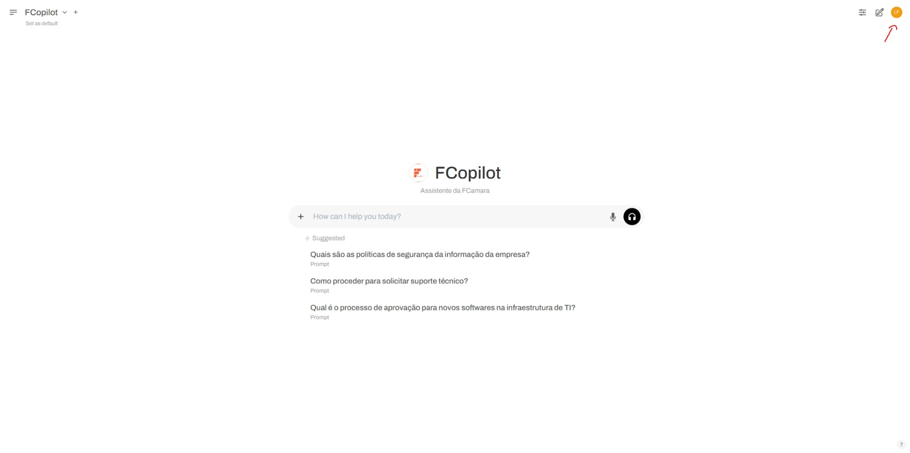
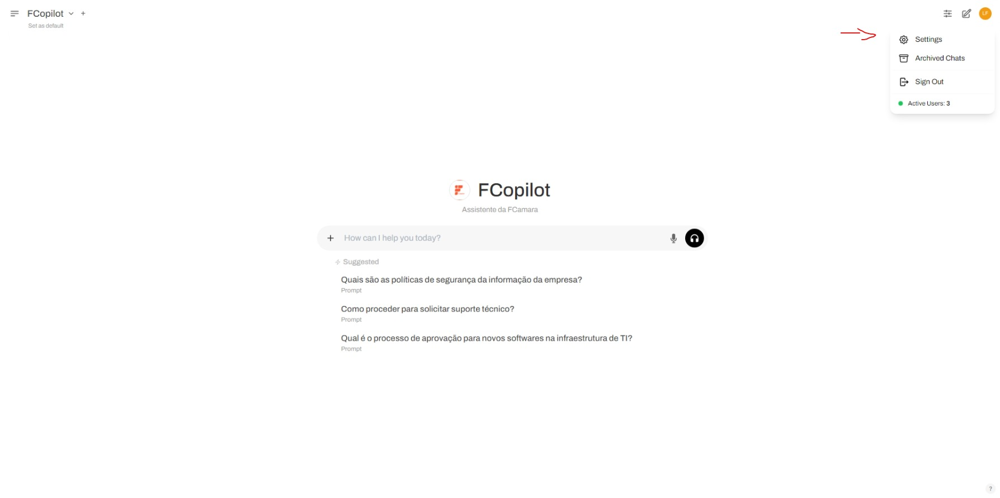
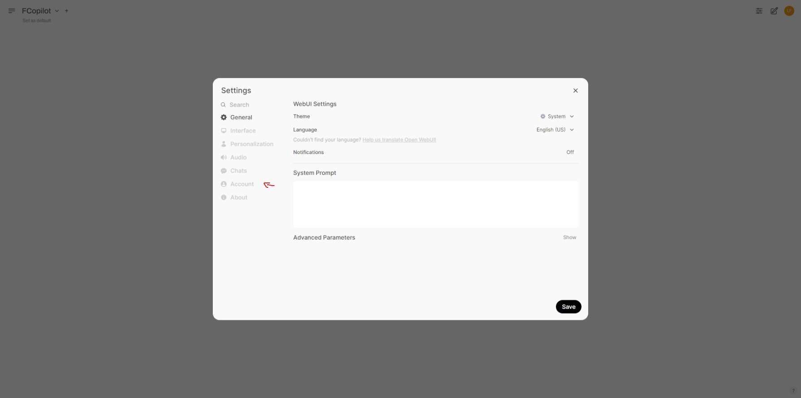
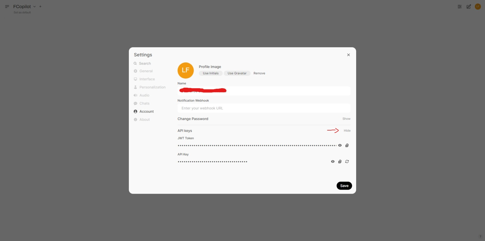

# **AI-Commit**

**AI-Commit** é uma extensão para o Visual Studio Code que gera mensagens de commit semânticas automaticamente, utilizando os recursos do FCopilot. Ideal para quem deseja manter boas práticas de versionamento sem esforço!

---

## **Requisitos**

- Um token JWT disponível no site do FCopilot.
- Conexão com a internet.

---

## **Instalação**

1. **Baixe a Extensão**:

   - Procure por **AI-Commit** na aba de extensões do Visual Studio Code.

2. **Configure o JWT**:
   - Obtenha seu JWT no site do FCopilot:
     1. Acesse [FCopilot](https://fcopilot.fcamara.com/).
     2. Clique na sua foto de perfil (ou nas iniciais caso não tenha foto).
        
     3. Vá para **Configurações (Settings)**.
        
     4. Na aba **Conta (Account)**, localize a seção **Chaves API**.
        
     5. Clique em **Mostrar** ao lado do JWT e copie o valor.
        
   - Quando solicitado pela extensão, insira seu JWT.

---

## **Como Usar**

1. **Geração Automática de Mensagens**:

   - Pressione `Ctrl + Shift + P` e procure por **Generate Commit Message**.
   - A mensagem será exibida na caixa de diálogo do controle de versão (ícone do Git no VS Code).

2. **Ação Direta no Git**:
   - No painel do Git, clique em **Gerar Mensagem** para criar automaticamente uma mensagem semântica para seu commit.

---

## **Recuperação de Erros**

Se o JWT expirar ou for inválido:

1. A extensão abrirá uma janela solicitando um novo JWT.
2. Insira o novo JWT e tente gerar a mensagem novamente.

---

## **Funcionalidades**

- Gera mensagens de commit semânticas com base no conteúdo do repositório.
- Integração com o painel de controle de versão do VS Code.
- Atualização rápida do JWT em caso de problemas.

---

## **Contribuições**

Contribuições são bem-vindas! Envie um Pull Request ou abra uma Issue para sugestões e melhorias.

---

## **Licença**

Este projeto é licenciado sob a [MIT License](./LICENSE).
